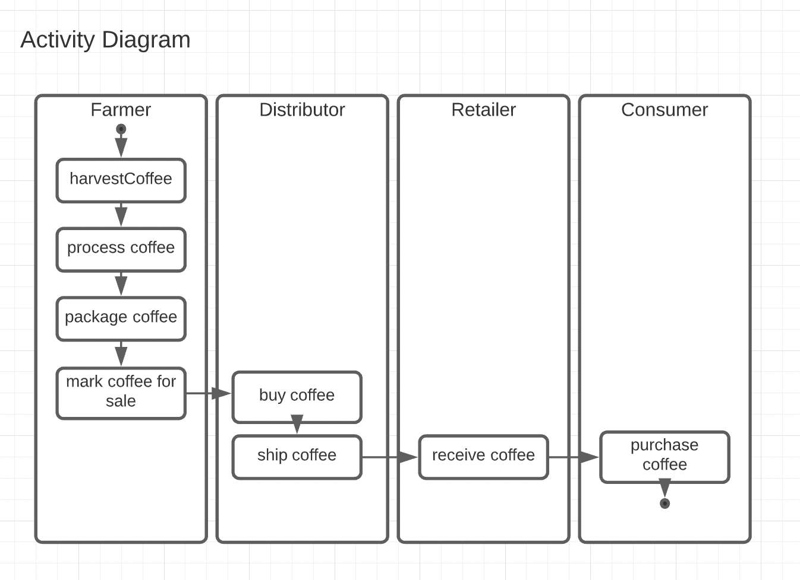
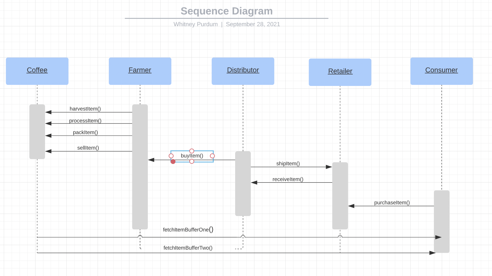
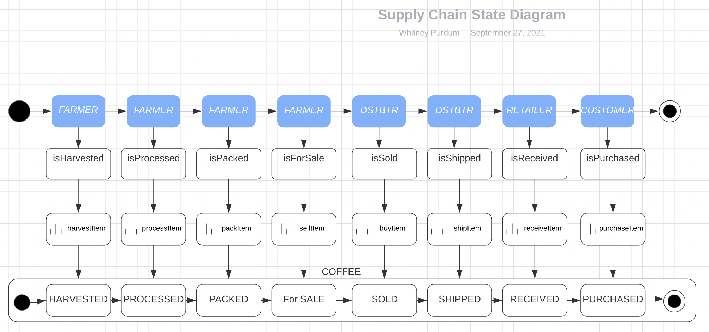
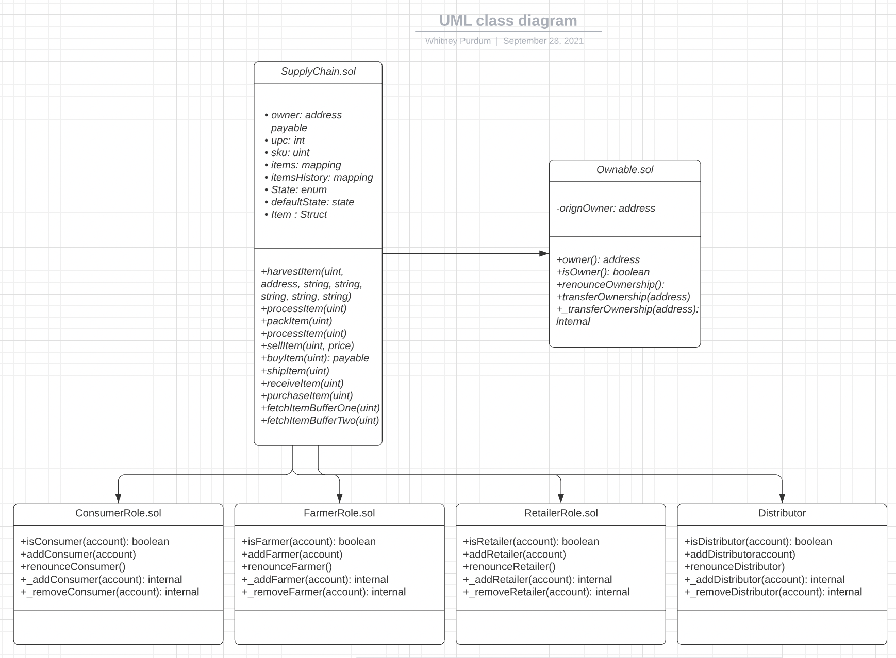

# UML Documents
## Supply Chain Activity Diagram

## Supply Chain Sequence Diagram

## Supply Chain State Diagram

## Supply Chain Class Diagram

## Contract addresses:
Using network 'rinkeby'.
  Deploying FarmerRole...
  ... 0x3cdd95f282bda1c35f1761f46fd7f2201baeaa621662b4a84c92f1856f4c75cb
  FarmerRole: 0xe476aa9c16865a326da099269a4b3a888768d6e9
  Deploying DistributorRole...
  ... 0x9a424351e77d0cbf539154f54facc07582a58bfb97aad22197881173e7e971e3
  DistributorRole: 0x80d12ab5db0a27d67bd158b3c70cc950e843be25
  Deploying RetailerRole...
  ... 0xedf54d635737fa5606a86644ac77d00b1af95bc0f7a10cdb613606cfad36258e
  RetailerRole: 0x0dec996d1944b81e3fe6a5cc13b39a1e0eb15a8d
  Deploying ConsumerRole...
  ... 0x90f9a81f953454f99e231df2fc75d9219605e1052051ed4fd0d77533fbebc390
  ConsumerRole: 0xc14631ffa80303bd1e9c3c1649776492f871e48d
  Deploying SupplyChain...
  ... 0xe2c2e5a651e2feb95ede4560fd481dc432471f3d7c88c779850dc2a40209e30d
  SupplyChain: 0xc65101776c56e70f9e50cc02d0d75e763c63ecf0
Saving successful migration to network...
  ... 0x5e336938f0abd6841255f0560c74529aa3e918e82c3c22db9fbd7b1d04bb5c55

  ## Libraries Used
  1. truffle-hdwallet-provider - for deploying contracts to Rinkeby 
  
  ## Package Versions:
  	Node - v8.10.0
  	Truffle v4.1.14 (core: 4.1.14)
	Solidity v0.4.24 (solc-js)
	web3 v^1.5.3"

## Tests Passing
